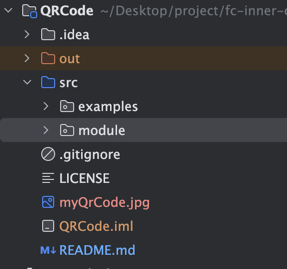
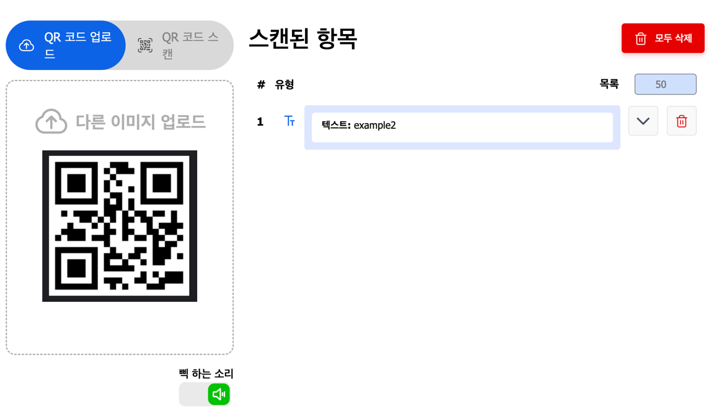

# QR Code Library for Java T

### 프로젝트 개요

이 프로젝트는 자바 기반 애플리케이션에서 QR 코드를 쉽게 생성하고 읽을 수 있는 경량화된 QR 코드 라이브러리를 제공하기 위해 설계되었습니다. 
사용자 친화적인 API와 확장성을 갖춘 이 라이브러리는 다양한 애플리케이션에서 손쉽게 통합 및 활용될 수 있습니다.

주요 기능
- QR 코드 생성: 텍스트, URL, 기타 데이터에서 고품질 QR 코드를 생성합니다.
- QR 코드 색상 변경: Enum 으로 정의된 색상을 활용하여 다양한 색상의 QR 코드를 생성합니다.
- 이미지 지정: 이미지 명, 이미지 포맷을 정의하여 원하는 형식의 이미지를 생성합니다.
- 데이터 가공: 데이터를 압축하고, 해당 데이터를 base64로 변경하여 사용할 수 있습니다.

적용 사례
- 전자결제 시스템
- 이벤트 티켓 발급 및 검증
- URL 단축 서비스 및 공유
- 교육용 퀴즈 및 설문조사 도구

사용 예시
1. QRCode 생성
```java
String text = "example2";
QrCode qr = new QrCode(text)
    .addModule(new ImageModule("myQrCode", "jpg"));
qr.initialize();
```

2. 이미지 생성



3. 데이터 확인




